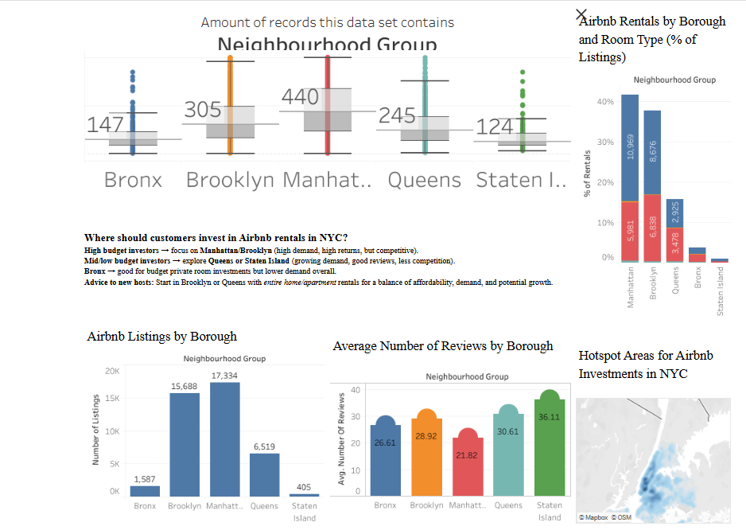

# Airbnb Investment Insights in New York City

**Author:** Dhanalakshmi Kannur Munirathnam  
**Tool:** Tableau  
**Dataset:** Inside Airbnb – NYC Listings Data (2023 Snapshot)

---

## 📊 Project Overview
This Tableau dashboard explores **Airbnb listings across New York City** to help potential investors identify high-return neighborhoods.  
It evaluates borough-wise performance metrics such as listing counts, average reviews, room types, and pricing patterns to recommend optimal investment locations.

---

## 🎯 Key Insights
- **Manhattan & Brooklyn** dominate in both demand and returns but face higher competition and costs.  
- **Queens & Staten Island** offer growing opportunities for budget investors with less competition and high review ratings.  
- **Bronx** favors private room investments but with limited overall demand.  
- New hosts can balance affordability and growth by starting in **Brooklyn or Queens**.

---

## 🗺️ Dashboard Components
1. **Box Plot:** Distribution of listings by borough (variance & outliers)  
2. **Bar Charts:** Listings count and average reviews per borough  
3. **Stacked Bar:** Room-type proportion by neighborhood group  
4. **Map:** Geospatial hotspots for Airbnb investments in NYC  
5. **Text Insights:** Strategic recommendations for high, mid, and low budget investors  

---

## 🧠 Tableau Techniques Used
- Box plots for distribution analysis  
- Mapbox integration for geospatial visualization  
- Combined dashboard containers and hierarchical layout  
- Custom color palette for borough categorization  
- Dynamic annotations for investment tips and insight highlights  

---

## 🌐 View Interactive Dashboard
[View on Tableau Public →](https://public.tableau.com/app/profile/dhanalakshmi.kannur.munirathnam/viz/AirbnbInvestmentInsightsNYC/Dashboard1?publish=yes)

---

## 📷 Preview

---

## 📂 Files
| File | Description |
|------|--------------|
| `Dhanalakshmi-Kannur-Munirathnam-BIS582 Mini Project I.twbx` | Tableau workbook |
| `1.png` | Dashboard screenshot |

---

## 💡 Reflection
This project helped me apply **geospatial analysis and comparative filtering** in Tableau to derive real-world investment insights.  
It demonstrates how data visualization can guide business decisions through an interactive, story-driven dashboard.
